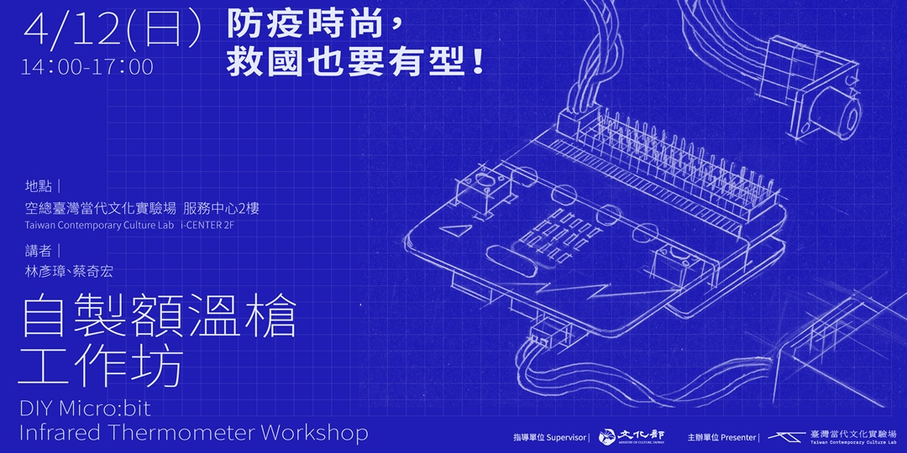

Language: [中文](#自製-microbit-額溫槍工作坊)、[English](#diy-microbit-infrared-thermometer-workshop)

# 自製 Micro:bit 額溫槍工作坊

### *防疫時尚，救國也要有型！*

## 計畫說明

　　[空總臺灣當代文化實驗場(C-LAB)](https://clab.org.tw/) 2020 年重點發展軸線之一為建立科技媒體實驗平台 (Technology Media Experimental Platform)，將著重於實驗創新與社會鏈結，並陸續成立各類型科技媒體實驗室，以跨域、共創、協作的方式，聯合推動文化與科技的實驗計畫。

　　全球因 COVID-19 疫情蔓延，演變為防疫物資搶購與缺乏的亂象，為發揮實驗自造者Maker精神，由背景來自生物醫學、電子工程、科技藝術家、建築等講師共同主動發起參與，並由C-LAB統籌策辦防疫二部曲之[「自製 Micro:bit 額溫槍」](https://www.facebook.com/events/1256402524561887/)工作坊，與[「紫外燈消毒口罩盒」](https://www.facebook.com/events/219780425920506/)工作坊，以藝術行動主義支持防疫，帶領民眾一起捲起袖子，透過知識原理分享及實作，認識紫外線消毒原理與實際效果，與動手自製 Micro:bit 額溫槍。

　　自製 Micro:bit 額溫槍工作坊由內文中提到的四位共同教學，其中工程師林彥璋與新媒體藝術家蔡奇宏負責 Micro:bit 程式寫作以及額溫槍元件組裝，黃瑋瑋與李家祥設計摺紙外殼共同教學，利用生活容易取得的材料與許多中小學已經應用在課程中的 microbit 控制板，來 DIY 製作額溫槍，希望為買不到額溫槍的人們，提供一個快速的解決方案。

　　關於工作坊活動緣起及詳細說明，請看《[防疫時尚，救國也要有型！自製額溫槍工作坊](https://www.facebook.com/events/1256402524561887/)》活動說明專頁。

## 關於這個 Repository

　　C-LAB 秉持開放文化自由分享精神，工作坊的文字、影像、設計、程式碼採用「公眾領域貢獻宣告」（CC0）釋出供公眾自由使用。 「自製Micro:bit 額溫槍」工作坊在GitHub上可以找到所需的資訊。包含設備清單、組裝說明、程式碼、外殼設計，以及它們相關的說明文件，我們也樂見你用這裡的資料去開設一個工作坊推廣，幫助更多需要額溫槍的人們。

　　GitHub 程式碼平台: https://github.com/clab-cetm/DIY-Thermometer-Using-Microbit

* case-design -- 存放了不同外形盒設計的點子，每個資料夾都是一種設計點子
* docs -- 工作坊投影片、組裝說明書
* makecode -- micro:bit 的程式以及說明文件
* video -- 活動相關影片
* visual-design -- 視覺設計

## 講師簡介

**林彥璋 Andrew Lin**

網通廠軟體工程師。於2014年接觸開源硬體、2015年認識新媒體藝術後，一直當假日創客至今。  
　

**曹存慧 Theresa Tsun-Hui TSAO**

創作團體遠房親戚實驗室成員，群島社群成員，生物工程師。自澳洲昆士蘭理工大學熱帶作物研究群組（現納入未來環境研究所）博士畢業後，於2009年至2018年間，先後在中研院農生中心，台大資工所與生化所、臺大醫院精神醫學部與基因醫學部等處，從事基因工程、分子生物學、次世代定序與轉錄體學的科學研究。近年藝術作品「憂生學」、「有我在™」、「血電廠」、「療刺」、「愛@窒息」中，使用生物科技、（類）醫療行為、活體材料等，討論科學局限以及感知的可曲變性。  
　

**蔡奇宏 TSAI Chi-Hung**

從資訊背景踏入新媒體藝術，創作主要致力於將類比與數位以多種方式進行混合，近年來與不同領域的伙伴持續玩耍，擅長整合各種技術形式來探索不同媒材之間的可能性。  
　

**謝佑承 Yu-Cheng HSIEH**

1992年出生於台灣，目前生活與工作於台北。創作關注媒體時代中影像、機器和實體空間之間的認知經驗，藉由製造臨場的觀察誤區，探索人與世界的觀看意識與存在關係。作品曾獲第17屆台新藝術獎第四季季提名、2018「當代藝術賞」首獎、「台南新藝獎」、2016「全國美術展」新媒體藝術類銀獎、「世安美學獎」造型藝術類、2016-2017二度入選歐洲藝術學院聯盟NEUNOW藝術季、展會與私人收藏。戶外製作項目見於2019-2020「月津港燈節」、2018「關渡光藝術節」與2017年「白晝之夜」等。
　

## 團隊名單

* 主辦單位：空總臺灣當代文化實驗場C-LAB 科技媒體實驗平台
* 概念統籌：蔡宏賢
* 生物講師：曹存慧
* 電子工程講師：蔡奇宏、林彥璋
* 新媒體藝術講師：謝佑承
* 程式設計：林彥璋
* 硬體設計：蔡奇宏、林彥璋
* 造型設計：李家祥、黃瑋瑋
* 企劃執行：陳品伊、蔣孟涵、謝澤旻
* 行銷推廣：劉郁青、黃怡翔、洪凱祥
* 主視覺設計：邱璽民
* 攝影執行：桑杉學、周肥、吳佩芩、黃柏超
* 直播執行：陳韋均、詹佳儒
* 授權顧問：莊庭瑞
* 平面設計：崔壯維
* 詳細課程內容請洽 執行製作組 謝澤旻 chemin@clab.org.tw
* 公關媒體聯繫請洽 行銷推廣組 黃怡翔 yiseanh@clab.org.tw

空總臺灣當代文化實驗場 C-LAB [www.clab.org.tw](https://clab.org.tw/)

# DIY Micro:bit Infrared Thermometer Workshop

### *DIY Virus Fighter Workshop Series: Hygiene is in. Germs are out.*

## Project Description

[C-LAB’s Technology Media Experimental Platform](https://clab.org.tw/en/) focuses on experimental innovation and social connection. With an interdisciplinary, co-creative, and collaborative approach, C-LAB is constructed into a cultural and technological experimental platform containing a broad range of media and technology laboratories.

The escalating COVID-19 pandemic panics people around the globe. To fight against the pandemic with a maker’s spirit, C-LAB is organizing a series of workshops for DIY Micro:bit Infrared Thermometer, DIY UV Light Box, etc. Experts from biomedicine, electrical engineering, Tech Art, and architecture collectively initiate and contribute to the workshops, share and practice their knowledge, and empower each other to act through art to handle this crisis. Everyone is welcome to join and take part in these workshops which bring together Tech Art with chic design and take tangible action in this global fight. Participants of the workshops will learn the principles and the methods of UV light disinfection, and be equipped with the ability to make their own Micro:bit, a pocket-sized infrared forehead thermometer.

This DIY Micro:bit Infrared Thermometer Workshop will be jointly taught by engineer Andrew LIN, new media artist TSAI Chi-Hung, and co-designers of the thermometer’s folded-paper casing, HUANG Weiwei and Jason LEE. This infrared thermometer is made with easily accessible everyday materials and microbit modules that elementary and junior high school students are already using in their classes. Hopefully this DIY infrared thermometer could provide a quick solution for the thermometer shortage at the moment.

## About the Repository

C-LAB upholds the spirit of open culture and free sharing, and all the information from these workshops, including written information, images, designs, and programming codes, will be available to the public under CC0 - Creative Commons.   

GitHub: https://github.com/clab-cetm/DIY-Thermometer-Using-Microbit

## About the Lecturers

**Andrew LIN**

Network communication software engineer, Andrew Lin, has been a “weekend maker” since he came into contact with open-source hardware in 2014 and new media art in 2015.  

**TSAI Chi-Hung**

Coming from a background in information, TSAI Chi-Hung works with new media art and focuses on merging analog and digital elements in a diverse range of ways. In recent years, he continues to experiment and collaborate with people from different disciplines and specializes in integrating different technologies to explore different media’s potential. 

## Creative Team

* Presenter: Taiwan Contemporary Culture Lab (C-LAB) – Technology Media Experimental Platform
* Concept Director: Escher TSAI
* Biology Lecturer: Theresa Tsun-Hui TSAO
* Electrical Engineering Lecturer: Andrew LIN, TSAI Chi-Hung
* New Media Art Lecturer: HSIEH Yu-Cheng
* Program Designer: Andrew LIN
* Hardware Designer: Andrew LIN, TSAI Chi-Hung
* Style Designr: HUANG Weiwei, Jason LEE
* Executive Producer: CHEN Ping-Yi, Monique CHIANG, HSIEH Che-Min
* Marketing & Promotion: LIU Yuching, Sean HUANG, Jimmy HUNG
* Visual Designer: CHIU Hsi-Ming
* Manual Designer: Awai Tswei
* Photographer: Vincent SANG, HUANG Po-Chao
* Live-Stream: Oris CHEN, Ed 
* Licensing Consultant: CHUANG Tyng-Ruey
* For further information please contact:
	* HSIEH Che-Min, chemin@clab.org.tw 
	* Sean HUANG, yiseanh@clab.org.tw 

Taiwan Contemporary Culture Lab (C-LAB) [www.clab.org.tw](https://clab.org.tw/)