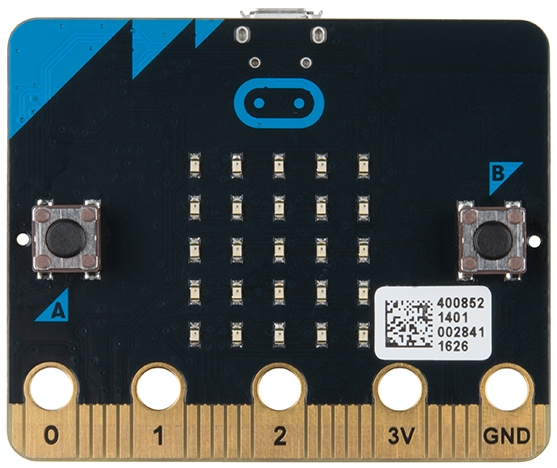
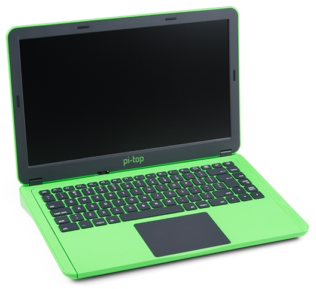
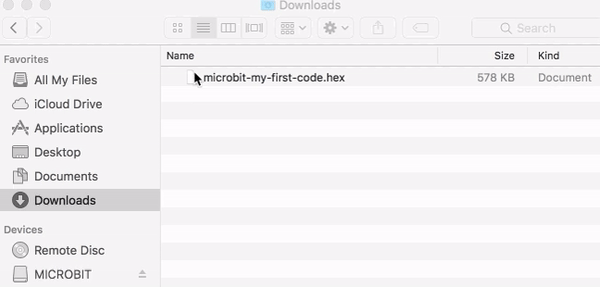
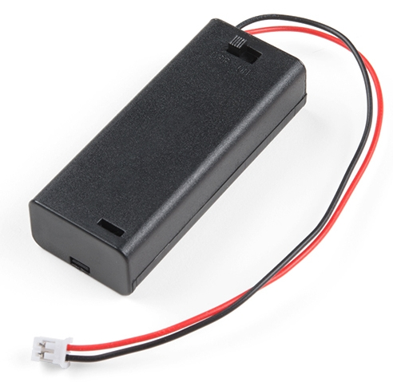
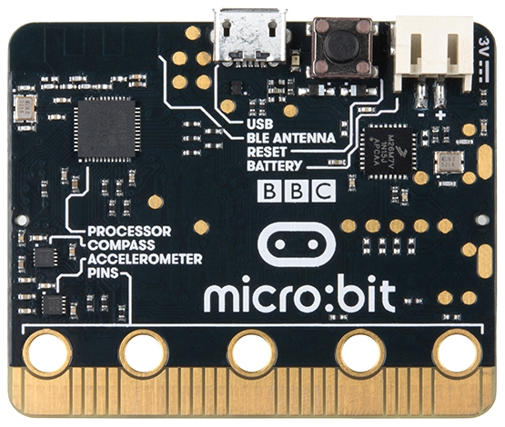

# 10 Minute microbit Guide

*ver 1.0*

---

[Micro:bit](https://microbit.org) 是由 BBC 設計給英國學童學習編程和電子創作的微控制器。

## 大綱

* 需要準備那些東西
* microbit 的開發流程
* 使用什麼工具開發
	* MakeCode 開發工具簡介
* 寫好的程式怎麼轉移到 microbit 上運作
* 關於供電
* 如何分享你的作品

## 你所需要準備的東西

使用 microbit 創作時，你只需要三個東西:

1. microbit 主板
2. micro-usb 傳輸線
3. 可以上網的電腦

## microbit 的開發流程

你可以將 microbit 視為一台能放在口袋的微型電腦，但要讓這台電腦工作，你必須撰寫程式來告訴 microbit 要做什麼事情。你寫的程式就是我們一般所稱的軟體。

步驟是這樣的：

1. 在你的電腦上使用 `microbit 專用的程式編輯器`將軟體程式寫好
2. 使用 `micro-usb` 線連接你的電腦和 microbit 主板
3. 將寫好的軟體透過 micro-usb 線`下載`到 microbit 主板上
4. microbit 就能夠按照你所寫的程式運作（如果你寫的程式沒問題的話）。

## 選擇 microbit 專用的程式編輯器

就像 WORD 是用來讓你寫文件的編輯器、PowerPoint 是用來讓你製作簡報的編輯器一樣，所謂的 `程式編輯器` 就是一個讓你用來 "寫程式" 的專用編輯器。

以 microbit 來說，目前比較常見的兩種編輯器：

* [MakeCode](https://makecode.microbit.org/)
	* 使用積木拼圖的方式 "拼出" 程式的流程
	* 特別推薦給初學使用者
* [Python for micro:bit](https://python.microbit.org/v/2.0)
	* 使用 Python 語言
	* 文字模式的編寫方式

這裡我們選擇的是 MakeCode

### MakeCode 環境介紹

* 模擬區 - 可以讓你在沒有板子的時候就看到效果
* 積木區 - 用這邊的積木拼成你的程式流程
* 存檔 　- 存成 hex 檔案 (內容包含程式碼資訊)
* 教學區 - 內建的教學資源

## 下載你的程式到 microbit

1. 確保您的 microbit 已經透過 micro-usb 線材連接到電腦。
2. 你應該會發現 microbit 被你的電腦當作一個隨身碟
3. 在 MakeCode 上點 "下載" 按鈕，將會下載一個 .hex 檔
4. 將 hex 檔拖曳到磁碟機 (或是複製貼上都可以)
	* 傳輸過程中，電路板背面的橙色電源LED會開始閃爍。一旦停止閃爍，傳輸就完成了
5. 就這樣，現在可以觀察 microbit 運作的樣子是否跟你想的一樣

## 關於供電

你絕對不想每次使用 microbit 的時候都拉著 usb 線和電腦。可以使用外接電池盒，使用兩個 AAA 電池供電。

插槽在背面右上角。

## 如何分享你的作品

使用 MakeCode 編輯器的 `分享專案` 功能，即可分享你的作品。

ex: [額溫槍模擬器v2](https://makecode.microbit.org/_JxsbYaXXLLJv)

### 如何取得程式碼？

事實上，下載到 microbit 的 .hex 檔案就包含了程式碼的資訊。在 MakeCode 中使用`匯入`的功能即可。

~ END ~