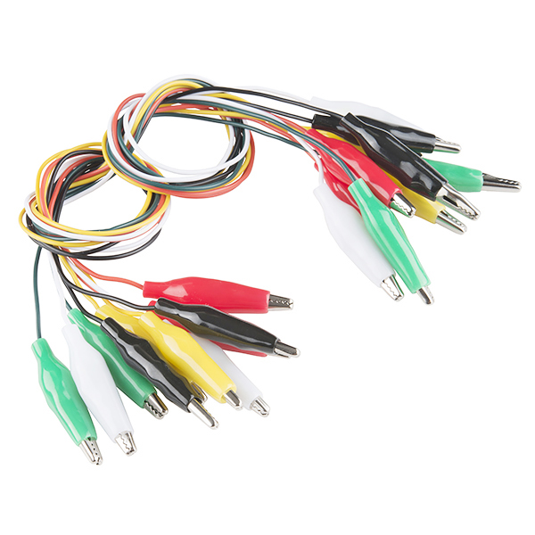
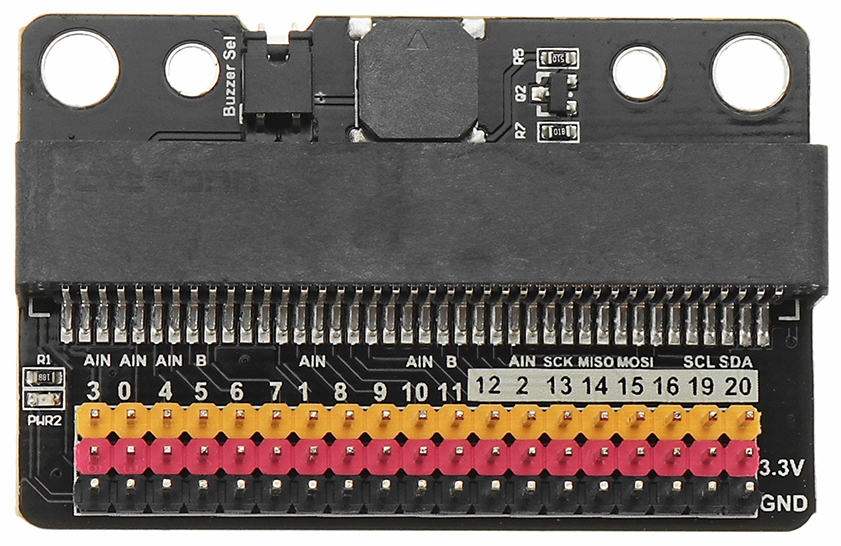

Language: [中文](#十分鐘了解-microbit)、[English](#10-minute-microbit-guide)

# 十分鐘了解 Micro:bit

[Micro:bit](https://microbit.org) 是由 BBC 設計給英國學童學習編程和電子創作的微控制器。

## 大綱

* 需要準備那些東西
* microbit 的開發流程
* 使用什麼工具開發
	* MakeCode 開發工具簡介
* 寫好的程式怎麼轉移到 microbit 上運作
* 關於供電
* 如何分享你的作品

## 你所需要準備的東西

使用 microbit 創作時，你只需要三個東西:

1. microbit 主板
2. micro-usb 傳輸線
3. 可以上網的電腦

## microbit 的開發流程

你可以將 microbit 視為一台能放在口袋的微型電腦，但要讓這台電腦工作，你必須撰寫程式來告訴 microbit 要做什麼事情。你寫的程式就是我們一般所稱的軟體。

步驟是這樣的：

1. 在你的電腦上使用 `microbit 專用的程式編輯器`將軟體程式寫好
2. 使用 `micro-usb` 線連接你的電腦和 microbit 主板
3. 將寫好的軟體透過 micro-usb 線`下載`到 microbit 主板上
4. microbit 就能夠按照你所寫的程式運作（如果你寫的程式沒問題的話）。

## 選擇 microbit 專用的程式編輯器

就像 WORD 是用來讓你寫文件的編輯器、PowerPoint 是用來讓你製作簡報的編輯器一樣，所謂的 `程式編輯器` 就是一個讓你用來 "寫程式" 的專用編輯器。

以 microbit 來說，目前比較常見的兩種編輯器：

* [MakeCode](https://makecode.microbit.org/)
	* 使用積木拼圖的方式 "拼出" 程式的流程
	* 特別推薦給初學使用者
* [Python for micro:bit](https://python.microbit.org/v/2.0)
	* 使用 Python 語言
	* 文字模式的編寫方式

這裡我們選擇的是 MakeCode

### MakeCode 環境介紹

* 模擬區 - 可以讓你在沒有板子的時候就看到效果
* 積木區 - 用這邊的積木拼成你的程式流程
* 存檔 　- 存成 hex 檔案 (內容包含程式碼資訊)
* 教學區 - 內建的教學資源

## 下載你的程式到 microbit

1. 確保您的 microbit 已經透過 micro-usb 線材連接到電腦。
2. 你應該會發現 microbit 被你的電腦當作一個隨身碟
3. 在 MakeCode 上點 "下載" 按鈕，將會下載一個 .hex 檔
4. 將 hex 檔拖曳到磁碟機 (或是複製貼上都可以)
	* 傳輸過程中，電路板背面的橙色電源LED會開始閃爍。一旦停止閃爍，傳輸就完成了
5. 就這樣，現在可以觀察 microbit 運作的樣子是否跟你想的一樣

## 關於擴展板

仔細看 micro:bit 的金手指區可以發現：除了 P0, P1, P2, 3V, GND 這幾個腳位面積比較大，比較方便直接使用鱷魚夾接線以外，其餘的腳位寬度都太小，不方便使用。

因此，通常製作專案的時候，都會另外採買稱為 I/O 擴展板的設備。只要將 micro:bit 插入擴展板的插槽內，就可以直接使用擴展板引出的腳位，方便做接線控制使用。

## 關於供電

你絕對不想每次使用 microbit 的時候都拉著 usb 線和電腦。可以使用外接電池盒，使用兩個 AAA 電池供電。

插槽在背面右上角。

## 如何分享你的作品

使用 MakeCode 編輯器的 `分享專案` 功能，即可分享你的作品。

ex: [額溫槍模擬器v2](https://makecode.microbit.org/_JxsbYaXXLLJv)

### 如何取得程式碼？

事實上，下載到 microbit 的 .hex 檔案就包含了程式碼的資訊。在 MakeCode 中使用`匯入`的功能即可。

# 10 Minute microbit Guide

[Micro:bit](https://microbit.org) is a microcontroller designed by the BBC for use in computer programming education and creative electronic projects for children in the UK.

Outline 

* What you will need 
* Micro:bit development process 
* What tools are needed 
	* About MakeCode 
* How to transfer and run a finished program on micro:bit 
* About power supply 
* How to share your work 

## What You Will Need 

You only need 3 things when working with micro:bit:  

1. A micro:bit board 
2. A Micro USB cable 
3. A computer that is connected to the internet 

## Micro:bit Development Process  

Think of micro:bit as a mini computer that you can fit in your pocket. In order to work with this computer, you will need to write a program to tell it what to do. The program that you will write is typically referred to as software. 

These are the steps: 

1. Use a program editor deigned for micro:bit to write a software program on your computer. 
2. Connect your computer and the micro:bit board using a Micro USB cable. 
3. Download the finished program to the micro:bit board using a Micro USB cable. 
4. Micro:bit will begin running according to the program you’ve written (if there are no issues with your program). 

## Selecting a Program Editor for Micro:bit 

Similar to how Microsoft Word is used for word processing, and PowerPoint is used for creating a presentation, a program editor allows you to write programs. 

There are typically two editors that are used with micro:bit. 

* [MakeCode](https://makecode.microbit.org/)
	* A programming tool that fits code elements together like puzzle pieces. 
	* Recommended for beginners. 
* [Python for micro:bit](https://python.microbit.org/v/2.0)
	* Uses the Python programming language.
	* Uses a scripting programming approach. 

We've chosen to use MakeCode for this project. 

## MakeCode Setup 

* Simulator -- Where you can see immediate feedback without using a board. 
* Block Editor -- Use the blocks to construct your program.
* Save the Files -- Save your files using the .hex file extension (containing code information).  
* Education Section -- Built-in educational resources. 

## Download Your Program onto Micro:bit 

1. Be sure to connect your micro:bit to a computer using a Micro USB cable. 
2. When you plug the micro:bit into a computer’s USB socket, it will show up automatically like any other USB storage or memory stick as a drive called “MICROBIT”.
3. Click “download” on MakeCode; a .hex file will be downloaded. 
4. Drag the .hex file to the drive (or copy and paste) 
	* During the transferring process, an orange LED light on the back of the circuit board will flicker. When the file transferring is done, the light will stop flickering. 
5. That’s it! Now observe to see if the micro:bit is working properly. 

## About IO Expansion Board

Take a closer look of the edge connector pins on the micro:bit and you will see that P0, P1, P2, 3V, and GND have larger pins that make it easier to for an alligator clip to be attached to them. The rest have pins that are too narrow and not that easy to work with. 

Therefore, a device called the IO expansion board is typically used when we work on a project. Just plug the micro:bit into the expansion board and this board will lead out all IO ports of micro:bit, making it easier to connect and work with. 

## About Power Supply

You probably wouldn’t want to have to always connect to a USB cable and computer whenever you use your micro:bit. To solve this issue, you can use an external battery pack with two AAA batteries. 

The slot is on the upper-right corner on the back.

## How to Share Your Work

Simply use the “Share Project” function on MakeCode to share your work. 

ex: [Infrared Thermometer Simulator v2](https://makecode.microbit.org/_JxsbYaXXLLJv)

## How to Obtain Program Codes? 

The .hex file downloaded onto micro:bit already contains program code information, so just use the import function on MakeCode to obtain it. 

~ END ~
